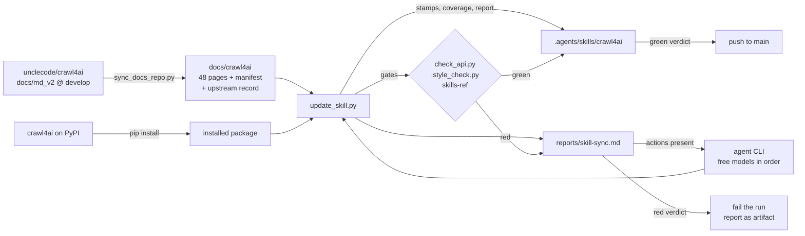

# crawl4ai skill + docs pipeline

[](https://github.com/Wildfire2282/crawl4ai-skill/actions/workflows/skill-check.yml)

Standalone project for the agent skill and the upstream documentation it is derived from. Every path
below is relative to this directory; the crawlers that share the same workspace live in their own
trees.

- `.agents/skills/crawl4ai/` — the published skill (agent-facing instructions, version-checked references, drift gate, evals).
- `docs/crawl4ai/` — a mirror of `unclecode/crawl4ai@develop:docs/md_v2`, the upstream source of truth.
- `scripts/` — the tools that keep the two in step.
- `.github/workflows/` — the same tools unattended: on a schedule, and on every push or pull request.



## The unattended run

`.github/workflows/skill-update.yml` is the whole loop, and it is designed so a quiet week costs one
API request and nothing else:

| Step | What it does | Cost when nothing changed |
| --- | --- | --- |
| probe | `sync_docs_repo.py --check` — one request for the tip of `develop` touching `docs/md_v2`, compared with the mirror's record and the skill's stamps | one request, no packages installed |
| fetch | `sync_docs_repo.py` — downloads only the pages whose blob id moved | skipped |
| update | `update_skill.py` — stamps, coverage, gates, probes, report | skipped |
| agent | only when the report lists an action; models from `scripts/agent-models.json`, tried in order, each attempt starting from the same restored tree | skipped |
| push | the same checks a pull request gets (`skills-ref validate`, `sync_docs_repo.py --verify`) run first — a `GITHUB_TOKEN` push does not trigger `skill-check` — then the run commits what the pipeline owns and pushes to the branch the run was triggered on, only when the verdict is green | skipped |

A red verdict (drift, a failed gate, an action no model closed) pushes nothing and fails the run,
with `reports/skill-sync.md` uploaded as an artifact. The next scheduled run starts from the same
committed state, so no change is ever marked as processed that was not.

## Layout

| Path | Role |
| --- | --- |
| `.agents/skills/crawl4ai/SKILL.md` | Entry point: preflight, routing table, procedure, invariants, file map |
| `.agents/skills/crawl4ai/references/API.md` | Signatures, defaults, result fields, import paths, CLI flags |
| `.agents/skills/crawl4ai/references/PATTERNS.md` | 14 task recipes, each with the observed result shape |
| `.agents/skills/crawl4ai/references/TROUBLESHOOTING.md` | Symptom → cause → fix → detection tables |
| `.agents/skills/crawl4ai/scripts/check_api.py` | Drift gate: names, parameters, methods, result fields, documented defaults, rejected legacy flags |
| `.agents/skills/crawl4ai/evals/` | Output eval cases (`evals.json`), grader (`grade.py`), trigger set and runner |
| `docs/crawl4ai/_manifest.json` | `{page: {path, url, title, blob, sha256, bytes}}` — the baseline the pipeline diffs against |
| `docs/crawl4ai/_upstream.json` | `{repository, branch, commit, commit_date, synced, pages, skipped}` — what the mirror was taken from |
| `docs/crawl4ai/_INDEX.md` | Generated section index, the carried pages, and every upstream page the policy leaves out |
| `scripts/sync_docs_repo.py` | Probe, mirror and record upstream: commits API → recursive tree → raw page bodies |
| `scripts/update_skill.py` | Snapshot diff, coverage merge, gates, stamps, optional probes and agent pass, report |
| `scripts/agent-models.json` | Free models in priority order for the unattended prose pass |
| `reports/skill-sync.md` | Latest run: upstream changes mapped to skill files, gate output, actions |
| `prompts/skill-sync/` | The update prompt kit: five stages the agent pass follows, entry point `00-overview.md` |
| `opencode.jsonc` | Tool permissions for the opencode 2 agent pass, native V2 form: `external_directory` allowed (the agent reads the installed package outside the checkout), `git push` / `git commit` denied. The workflow passes `--auto`, which auto-approves the remaining `ask` rules while a `deny` stays enforced |
| `.github/dependabot.yml` | Version updates: a weekly pull request for `requirements.txt` and one for the workflow actions, each proving itself against `skill-check` before it can merge |
| `.style_check.py` | Prose gate: pronouns, contractions, filler, emoji, a repeated version target. Exits non-zero on an issue |
| `.gitattributes` | LF on both ends of git: the manifest hashes page bytes, so a checkout must not rewrite them |
| `ruff.toml` | Lint standard for the scripts, the skill and the evals: the rule families a `ruff check` in the project root enforces. The mirror under `docs/` is upstream Markdown and is excluded; no workflow runs it |
| `LICENSE` | Apache-2.0, the license of the upstream project this mirror is derived from |
| `.evalcheck/` | Calibration runs for the eval suite and the recorded trigger transcripts; scratch, not shipped with the skill |

The skill stays at `.agents/skills/<name>/SKILL.md`: that is the path the agent runtime discovers, one
level below `skills/`. Everything else in this project is free to move.

## Running the pipeline

```bash
pip install -r requirements.txt && crawl4ai-setup     # once; the probes crawl example.com for real

python scripts/sync_docs_repo.py --check              # one request: exit 0 in sync, 3 work to do
python scripts/sync_docs_repo.py                      # incremental: only pages whose blob or bytes moved
python scripts/sync_docs_repo.py --verify             # offline: page bytes vs manifest, and the skill's stamps
python scripts/sync_docs_repo.py --full               # refetch every carried page
python scripts/sync_docs_repo.py --reindex            # offline: re-apply the curation policy
python scripts/update_skill.py                        # stamp, merge coverage, write the report
python scripts/update_skill.py --check-only           # verify only: what a pull request runs
python scripts/update_skill.py --probe                # add live re-observation of the quoted values
python scripts/update_skill.py --agent-cmd "opencode run --standalone --auto --model {model}" \
    --models-file scripts/agent-models.json           # the prose pass, retried down the model list
python scripts/update_skill.py --agent-cmd "omp -p --no-session" --force-agent   # any CLI, run anyway
python scripts/update_skill.py --baseline old_manifest.json                      # diff against a saved state
```

Exit codes: `sync_docs_repo.py` — `0` synced, `3` work to do (`--check`/`--verify` only), `2` unusable
input or an unreadable API. `update_skill.py` — `0` in sync with green gates, `1` drift or a failed
gate, `2` unusable input.

The docs never come from the rendered site. `sync_docs_repo.py` reads the repository, so the mirror is
the Markdown the docs are written in: no sitemap crawl, no browser, no copy-button artefact, and a
commit is a cheaper change signal than a page hash. Set `GITHUB_TOKEN` to raise the API rate limit
from 60 to 5000 requests an hour; the scheduled run's two or three requests fit in the anonymous one.

## What is generated, and what is not

| Artifact | Owner |
| --- | --- |
| `_INDEX.md`, `_manifest.json`, `_upstream.json`, mirrored page bodies | generated by `sync_docs_repo.py` (bodies are upstream Markdown; sibling-page links are re-pointed at their docs.crawl4ai.com URL) |
| `metadata.api-tracked`, `docs-commit`, `docs-snapshot`, `docs-pages`, `docs-synced`, `compatibility` target | generated by `update_skill.py`, only when both gates are green |
| `check_api.py` lists (imports, run params, browser params, methods, result fields) | union of the curated list and the names the skill prose cites |
| `check_api.py` `DEFAULTS` and `REJECTED_RUN_CONFIG_PARAMS` | hand-written: the values the references state |
| `SKILL.md` prose, `references/*.md` | hand-written; `update_skill.py` reports what to revisit |
| `reports/skill-sync.md` | generated per run; the artifact a failed run keeps, and the only file a manual run on an unchanged tree rewrites |
| `[verified: run]` markers | hand-set after executing a crawl. No unattended job writes a date it did not observe |

The pipeline refuses to stamp a version it cannot verify: a changed default, a missing name or a style
violation turns a gate red, the stamps stay as they were, and the report names the fix.

## Automation

| Workflow | Trigger | Runs |
| --- | --- | --- |
| `.github/workflows/skill-update.yml` | weekly cron, manual (`auto` / `full` / `agent` / `deterministic`) | probe upstream, mirror what moved, update the skill, run the gates, run the agent pass over `prompts/skill-sync/` when there is an action to close (`agent` forces it on a quiet tree), then push to the triggered branch. Red verdict: nothing is pushed and the run fails with the report attached |
| `.github/workflows/skill-check.yml` | push to `main`, pull request, manual | offline gates: API drift, style, `sync_docs_repo.py --verify`, the Agent Skills spec validator (`skills-ref==0.1.1`), and `update_skill.py --check-only` |

Prerequisites for the update workflow:

- The workflow needs `contents: write` (it declares it) and a branch that accepts the push: with
  `main` protected against bot pushes, point the run at an unprotected branch or allow
  `github-actions[bot]` to push. There is no pull request to review any more — the run merges itself
  by pushing, and only after every gate is green.
- Manual runs take a `mode`: `auto` (probe, then sync when there is work — a quiet tree ends the run
  after one request), `full` (refetch every carried page), `agent` (also force the prose pass on a quiet
  tree) and `deterministic` (never start the agent). `full` and `agent` always run the pipeline; the
  probe result cannot skip them.
- Repository variable `SKILL_AGENT_CMD` (optional) replaces the whole agent command, `{model}`
  placeholder included; `opencode run --standalone --auto --model opencode/muse-spark-1.3-contributor-free`
  is the shape to copy. Name a paid model there and add its key to the update step's `env:` as a
  secret. A CLI that is not installed degrades to the deterministic stages with a warning, and the
  manual `deterministic` mode skips the prose pass outright.
- The agent CLI is OpenCode 2, `npm install -g @opencode/cli@2.0.18`
  ([docs](https://opencode.ai/v2/docs/)) — pinned, because `run` flags and permission defaults move
  between releases. Two flags matter in a container: `--standalone` gives the run a private server
  (the shared background service can report `Timed out waiting for the background service to start`),
  and `--auto` auto-approves permissions that are not explicitly denied, which is what a `deny`-based
  config needs in a run with no client to answer an `ask`.
- `scripts/agent-models.json` is the free-model chain, in order, from
  <https://opencode.ai/zen/v1/models> (which models are free is stated on
  <https://opencode.ai/v2/docs/console/models/>). It is data, not code — update it when the free tier
  rotates. The free models need no credentials: verified against `@opencode/cli@2.0.18` with an empty
  home directory, `muse-spark-1.3-contributor-free`, `mimo-v2.6-flash-free`, `nemotron-3-ultra-free`
  and `big-pickle` all answer, while `mimo-v2.5-free`, `deepseek-v4-flash-free`,
  `muse-spark-1.2-contributor-free` and `jev-1.13-free` exit 1 with `Model unavailable` — which is why
  the MiMo slot in the chain names the 2.6-flash id. An unavailable id costs one attempt (~1 s) and
  nothing else: the attempt is discarded and the next model continues.

## Repository settings

The repository offers what the pipeline uses. Anything that reads the tree is on:

| Feature | State | Why |
| --- | --- | --- |
| Issues, Wiki, Projects | off | a drift report lands in `reports/skill-sync.md` and the skill's upstream bugs belong to `unclecode/crawl4ai`; the documentation is `docs/crawl4ai/`, not a wiki, and no board tracks the work |
| Actions | on, `GITHUB_TOKEN` read-only by default | a workflow has to ask for `contents: write` itself (`skill-update.yml` does, `skill-check.yml` does not) |
| CodeQL default setup (`python`, `actions`) | on, weekly | the three pipeline scripts are scanned on every push to `main`, every pull request, and on a weekly schedule |
| Dependabot alerts and security updates | on | `requirements.txt` pins the two packages both gates introspect |
| Dependabot version updates | `.github/dependabot.yml`, weekly | one pull request per ecosystem, gated by `skill-check` |
| Secret scanning and push protection | on | the repository is public, so a leaked credential would be public with it |
| Branch ruleset on `main` | none | the update workflow merges itself by pushing; a rule that requires a pull request would stall the scheduled run |

Validity checks and non-provider patterns stay off: the repository settings page exposes only the
master secret scanning switch and push protection, and the REST API accepts both fields in
`security_and_analysis` without applying them (`secret_scanning_validity_checks` is not in the writable
schema). Recheck after the account gains Secret Protection.

## Prompt kit

`prompts/skill-sync/` is what the agent pass is told to follow. `update_skill.py` hands
`00-overview.md` to the CLI and the CLI reads the rest as ordinary files, so the instructions live
under version control instead of inside the script.

| File | Stage |
| --- | --- |
| `00-overview.md` | Inputs, the order of the stages, and the six rules that fail the run when broken — no unobserved values, no edits to script-owned artefacts, no hand-edited generated lists, no weakening a gate, no hand-edited front matter, no silently dropped action |
| `01-triage.md` | Read the report; decide per upstream page: belongs in the skill / belongs in the mirror's policy / needs nothing; write the plan before editing |
| `02-references.md` | `API.md`, `PATTERNS.md`, `TROUBLESHOOTING.md` updated from the mirror and the installed package |
| `03-skill-md.md` | `SKILL.md` as the routing layer: rows, counts, invariants, preflight |
| `04-evidence.md` | Which marker each claim earns, and what may never be upgraded |
| `05-verify.md` | The gates and the report the session has to finish with |

The agent pass is re-derived afterwards: the gates run again, the names its new prose cites are merged
into `check_api.py`, and the actions are recomputed, so stage 5 is what the workflow measures.

## Curation policy

`SECTIONS` in `scripts/sync_docs_repo.py` lists the upstream sections that document using the crawl
API — `advanced`, `api`, `core`, `extraction`. `CURATED_OUT` names the pages inside them that are
still left out (the llmtxt and ask-ai apps, self-hosting, the crawl-dispatcher announcement), with a
reason each. Everything upstream offers but the policy excludes — blog, migration, apps, branding,
marketplace, the site and legal pages — is listed with its reason in `_INDEX.md` under "Not carried",
so a new upstream section is visible instead of silently ignored, and the report raises it as an
action when it appears.

## License

Apache-2.0 — see `LICENSE`. The skill, the scripts and the workflow files are original to this
project. `docs/crawl4ai/` is a mirror of the documentation of
[crawl4ai](https://github.com/unclecode/crawl4ai) (Apache-2.0, copyright its contributors), taken
from `docs/md_v2` in that repository; the only edits are the front matter the sync adds, the rewrite
of sibling-page links to their docs.crawl4ai.com URL, and the removal of the pages the policy
excludes.
