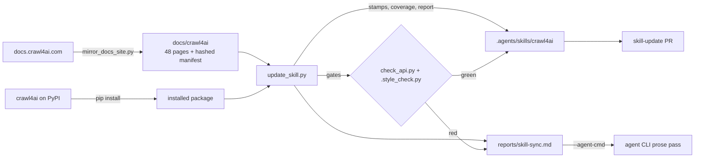

# crawl4ai skill + docs pipeline

[](https://github.com/Wildfire2282/crawl4ai-skill/actions/workflows/skill-check.yml)

Standalone project for the agent skill and the upstream documentation it is derived from. Every path
below is relative to this directory; the crawlers that used to share the tree (`blog_monitor.py`,
`intranet_harvest.py`) stay in their own workspace.

- `.agents/skills/crawl4ai/` — the published skill (agent-facing instructions, version-checked references, drift gate, evals).
- `docs/crawl4ai/` — a curated mirror of <https://docs.crawl4ai.com>, the upstream input.
- `scripts/` — the tools that keep the two in step.
- `.github/workflows/` — the same tools on a schedule and on every pull request.



## Layout

| Path | Role |
| --- | --- |
| `.agents/skills/crawl4ai/SKILL.md` | Entry point: preflight, routing table, procedure, invariants, file map |
| `.agents/skills/crawl4ai/references/API.md` | Signatures, defaults, result fields, import paths, CLI flags |
| `.agents/skills/crawl4ai/references/PATTERNS.md` | 14 task recipes, each with the observed result shape |
| `.agents/skills/crawl4ai/references/TROUBLESHOOTING.md` | Symptom → cause → fix → detection tables |
| `.agents/skills/crawl4ai/scripts/check_api.py` | Drift gate: names, parameters, methods, result fields, documented defaults, rejected legacy flags |
| `.agents/skills/crawl4ai/evals/` | Output eval cases (`evals.json`), grader (`grade.py`), trigger set and runner |
| `docs/crawl4ai/_manifest.json` | `{page: {url, title, sha256, bytes}}` — the baseline the pipeline diffs against |
| `docs/crawl4ai/_INDEX.md` | Generated section index, plus the curation policy that removed non-core pages |
| `scripts/mirror_docs_site.py` | Fetch the site (sitemap-driven), apply `CURATED_OUT`, rebuild index and manifest, `--reindex` offline |
| `scripts/update_skill.py` | Snapshot diff, coverage merge, gates, stamps, optional probes and agent pass, report |
| `reports/skill-sync.md` | Latest run: upstream changes mapped to skill files, gate output, actions |
| `prompts/skill-sync/` | The update prompt kit: five stages the agent pass follows, entry point `00-overview.md` |
| `opencode.json` | Tool permissions for the opencode agent pass — `permission: allow`, which also covers paths outside the checkout such as the installed package |
| `.gitattributes` | LF on both ends of git: the manifest hashes page bytes, so a checkout must not rewrite them |
| `LICENSE` | Apache-2.0, the license of the upstream project this mirror is derived from |
| `.evalcheck/` | Calibration runs for the eval suite and the recorded trigger transcripts; scratch, not shipped with the skill |

The skill has to stay at `.agents/skills/<name>/SKILL.md`: that is the path the agent runtime
discovers, one level below `skills/`. Everything else in this project is free to move.

## Running the pipeline

```bash
pip install -r requirements.txt && crawl4ai-setup     # once

python scripts/mirror_docs_site.py --root https://docs.crawl4ai.com --out docs/crawl4ai
python scripts/update_skill.py                        # write stamps, merge coverage, write the report
python scripts/update_skill.py --check-only           # verify only: what a pull request runs
python scripts/update_skill.py --probe                # add live re-observation of the quoted values
python scripts/update_skill.py --agent-cmd "omp -p --no-session"
python scripts/update_skill.py --baseline old_manifest.json   # diff against a saved docs state
```

Exit codes: `0` in sync with green gates, `1` drift or a failed gate (the report lists the actions), `2` unusable input.

## What is generated, and what is not

| Artifact | Owner |
| --- | --- |
| `_INDEX.md`, `_manifest.json`, mirrored page bodies | generated by `mirror_docs_site.py` (bodies verbatim from upstream) |
| `metadata.api-tracked`, `docs-snapshot`, `docs-pages`, `docs-synced`, `compatibility` target | generated by `update_skill.py`, only when both gates are green |
| `check_api.py` lists (imports, run params, browser params, methods, result fields) | union of the curated list and the names the skill prose cites |
| `check_api.py` `DEFAULTS` and `REJECTED_RUN_CONFIG_PARAMS` | hand-written: the values the references state |
| `SKILL.md` prose, `references/*.md` | hand-written; `update_skill.py` reports what to revisit |
| `[verified: run]` markers | hand-set after executing a crawl. No unattended job writes a date it did not observe |

The pipeline refuses to stamp a version it cannot verify: a changed default, a missing name or a
style violation turns the gate red, the stamps stay as they were, and the report names the fix.

## Automation

| Workflow | Trigger | Runs |
| --- | --- | --- |
| `.github/workflows/skill-update.yml` | weekly cron, manual | refresh the mirror, update the skill, install opencode and run the agent pass over `prompts/skill-sync/` (Zen free model by default; `SKILL_AGENT_CMD` overrides it), re-derive the verdict from the tree that agent left (gates, coverage, citations), push `skill-sync/upstream-docs`, open or edit a pull request, then fail the run if the report still lists actions |
| `.github/workflows/skill-check.yml` | push to `main`, pull request | offline gates: API drift, style, and `update_skill.py --check-only` |

Prerequisites for the update workflow:

- Repository variable `SKILL_AGENT_CMD` (optional) — an agent CLI prefix that replaces the workflow default, `opencode run --model opencode/big-pickle`. That default needs no secret: opencode's Zen free models answer without an account today. A CLI that is not installed degrades to the deterministic stages with a warning, and `-` as the manual input skips the agent pass entirely. To run a paid model instead, name it in the variable (`opencode run --model opencode/claude-sonnet-5`) and add the provider key to the update step's `env:` as a secret (`OPENCODE_API_KEY: ${{ secrets.OPENCODE_API_KEY }}`).
- The repository setting *Settings → Actions → General → Allow GitHub Actions to create and approve pull requests* must be on: with it off, the branch is pushed and the run then dies on `pull request create failed: GraphQL: GitHub Actions is not permitted to create or approve pull requests`.
- The built-in `GITHUB_TOKEN` needs `contents: write` and `pull-requests: write`; both workflows declare exactly those, so the repository default may stay read-only — the manual `skill-update` run that pushed `skill-sync/upstream-docs` did so while the default was still read-only.

The pull request carries `reports/skill-sync.md` as its body, and `skill-check` runs on it (a `pull_request` event from a `GITHUB_TOKEN`-authored pull request still starts the workflow; the push that created the branch does not).

## Prompt kit

`prompts/skill-sync/` is what the agent pass is told to follow. `update_skill.py` hands
`00-overview.md` to the CLI and the CLI reads the rest as ordinary files, so the instructions live
under version control instead of inside the script.

| File | Stage |
| --- | --- |
| `00-overview.md` | Inputs, the order of the stages, and the six rules that fail the run when broken — no unobserved values, no edits to script-owned artefacts, no hand-edited generated lists, no weakening a gate, no hand-edited front matter, no silently dropped action |
| `01-triage.md` | Read the report; decide per upstream page: belongs in the skill / belongs in `CURATED_OUT` / needs nothing; write the plan before editing |
| `02-references.md` | `API.md`, `PATTERNS.md`, `TROUBLESHOOTING.md` updated from the mirror and the installed package |
| `03-skill-md.md` | `SKILL.md` as the routing layer: rows, counts, invariants, preflight |
| `04-evidence.md` | Which marker each claim earns, and what may never be upgraded |
| `05-verify.md` | The three commands and the report the session has to finish with |

The agent pass is re-derived afterwards: the gates run again, the names its new prose cites are merged
into `check_api.py`, and the actions are recomputed, so stage 5 is what the workflow measures.

## Curation policy

`CURATED_OUT` in `scripts/mirror_docs_site.py` lists the upstream pages this project deliberately
does not carry — release notes, migration guides, site and legal pages, superseded snapshots — each
with a reason. The workflow fetches 41 pages fewer than the sitemap offers and never restores them.

## License

Apache-2.0 — see `LICENSE`. The skill, the scripts and the workflow files are original to this
project. `docs/crawl4ai/` is a verbatim mirror of <https://docs.crawl4ai.com>, the documentation of
[crawl4ai](https://github.com/unclecode/crawl4ai) (Apache-2.0, copyright its contributors); every
mirrored page keeps its `source:` URL in its front matter, and the only edits are the removal of the
pages `CURATED_OUT` lists and the front matter the crawler adds.
